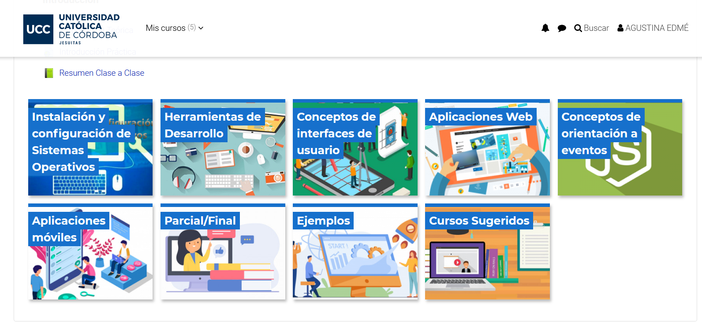
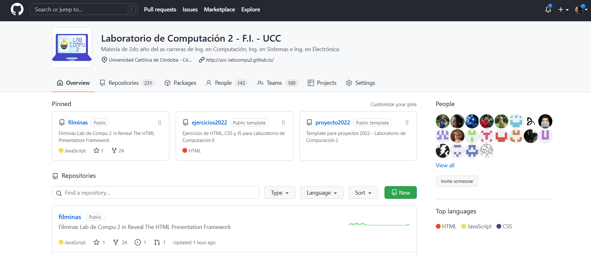

# Lab Compu II (Práctica)
Created by <i class="fab fa-telegram"></i>
[edme88]("https://t.me/edme88")

---
## ¿PROYECTO?
    
Relizar un ejercicio de **Física I** ó **Física II** ó **Matemática**

(o alguna idea propia que cumpla con los requisitos)

* User Interface (HTML5 y CSS3)
* Funcionalidad (Javascript, canvas, etc)

---
## PROYECTO: Requisitos básicos
La página debe tener:
* Imágines
* Campos de formulario
* Realizar algún cálculo o en base a la selección de usuario hacer algo
* Lienzo canvas para graficar o mostrar algo

---
## PROYECTO: Ideas
* Ejercicios de rectas numérica, conjunto de números, fracciones, ángulos
* Mini paint (selección de de pincel, colores)
* Cálculo de volumen de cuerpos geométricos
* Juegos sencillos (une con linea, carrera de autos)
* En el gym, elegis que queres entrenar, y sugiere ejercicios o arma un plan
* Música: Ejercicios de como tocar guitarra (u otro instrumento)
* Etc, etc, etc

---
## Ejemplos de Proyectos
[Historico de Proyectos](https://ucc-labcompu2-historico.github.io/)

---
## Aula Virtual
[http://campusvirtual.ucc.edu.ar](https://campusvirtual.ucc.edu.ar/course/view.php?id=4429)

---
## Organización en Github

[github.com/UCC-LabCompu2](https://github.com/UCC-LabCompu2)

