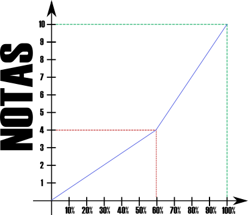

# Lab Compu II (Teórico)
Created by 
<i class="fab fa-telegram"></i> [edme88](https://t.me/edme88)

<!---

<!-- ## ¿Sáben Programar? -->
<!-- ## ¿Qué lenguajes conocen? -->
<!---

## ¿Han instalado windows?
-->

---
<!-- .slide: <!-- data-background="images/presentacion/lenguajes.png" data-background-size="50%" -->
<!-- .slide: data-background="images/configSO/OtrosOS.png" data-background-size="50%" -->
<!--## ¿Han usado un sistema operativo que no sea windows?-->
### Para romper el hielo... Juguemos un **Kahoot**
[Kahoot](https://create.kahoot.it/share/conociendonos-en-lab-de-compu-2/ae3a1b83-b59d-4e2c-bd9b-e6ae71333bce)

---
# LABORATORIO DE COMPUTACIÓN II

<!-- TODO: Insertar logo super cheta acá -->
La Materia

---
## Profesores
### Ing. Agustina Edmé Aliciardi
agustina.aliciardi@ucc.edu.ar

### Ing. Eduardo de Lima
1938033@ucc.edu.ar

---
## UNIDADES

**Unidad 1:** Instalación y configuración de Sistemas Operativos y Drivers

**Unidad 2:** Herramientas de Desarrollo

**Unidad 3:** Interfaces de usuario

**Unidad 4:** Aplicaciones Web

**Unidad 5:** Orientación a Eventos

**Unidad 6:** Aplicaciones móviles

---
## Calendario
| Semana | Unidad | Tema |
|--------|--------|------|
| 1 | 1 | Instalación de SO |
| 2 | 2 | Herramientas de Desarrollo |
| 3 | 3 | Interfaz de Usuario |
| 4 | 3 | Aplicaciones Web |
| 5 | 4 | HTML |
| 6 | 4 | CSS |
| 7 |   | 1er PARCIAL |

---
## Calendario
| Semana | Unidad | Tema |
|--------|--------|------|
| 8 | 5 | Orientación a Eventos |
| 9 | 5 | JavaScript |
| 10 | 5 | JavaScript |
| 11 |   | Proyecto Integrador |
| 12 |   | Proyecto Integrador |
| 13 | 6 | Aplicaciones Móviles |
| 14 |   | 2do PARCIAL |

---
## Forma de Evaluación: Cursado
* Proyecto Web: Primera Etapa (HTML+CSS)
* Proyecto Web: Segunda Etapa (JavaScript)
* Nota del promedio de 7 parcialitos teóricos multiple opción

---
## Forma de Evaluación: FINAL
FINAL:

*    Entrega a tiempo del proyecto
*    Mayor funcionalidad del programa
*    Preguntas sobre el código
*    Preguntas de la guía
*    Promocion de la parte Teórica   Promedio >= 8 y nota mínima 7

---
## Regularidad
* Asistencia del 70% en Clases Teórico-Prácticas (en el repositorio **ejercicio2023-Apellido** tener realizados los ejercicio de clase)
* Proyecto primera y segunda etapa aprobados (nota mínima de 4)
* Promedio de los 7 parcialitos >= 4

---
## Promoción
* Asistencia del 70% en Clases Teórico-Prácticas
* Promedio >= 8 y nota mínima 7 (3 notas: proyecto primera etapa, segunda etapa y promedio de parcialitos)

---
## Notas

<small>Tener en cuenta que un 60%=4, 70%=5.5, 80%=7, 90%=8.5</small>
