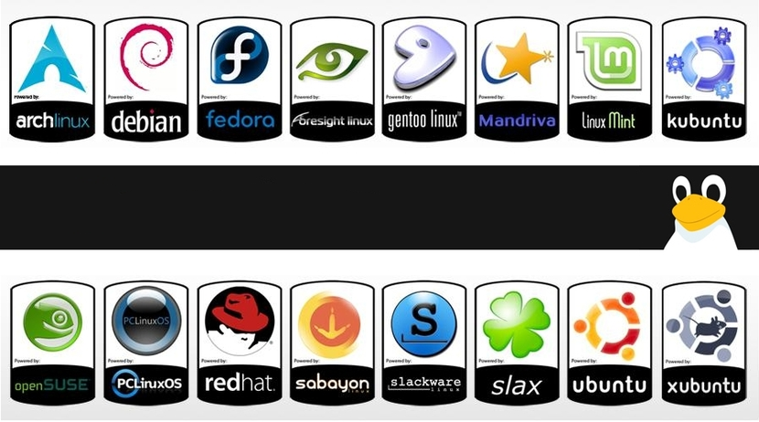
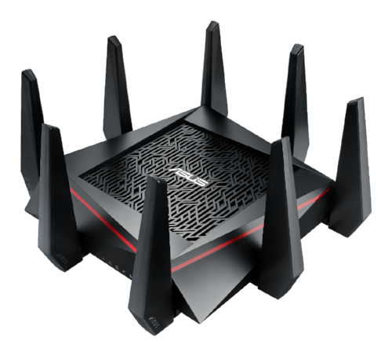
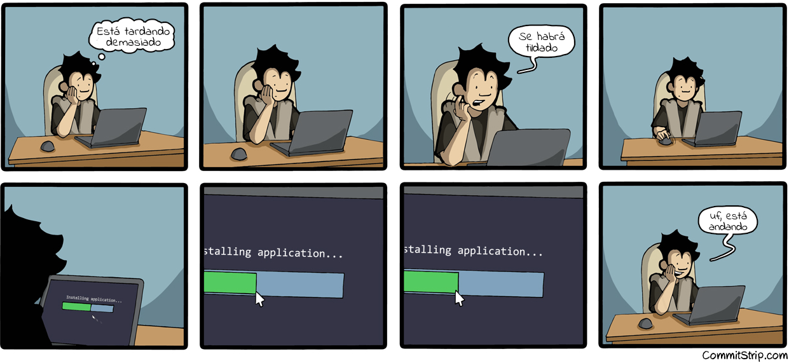
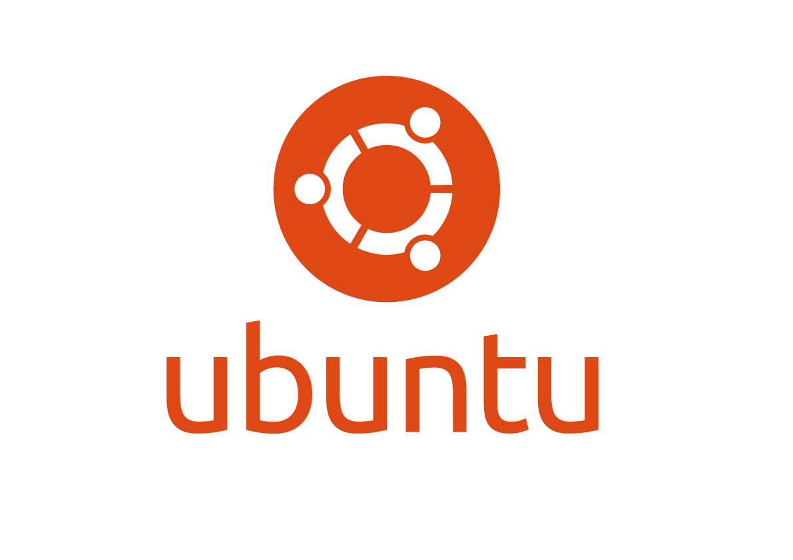

# Linux
<small>
Created by <i class="fab fa-telegram"></i>
[edme88]("https://t.me/edme88") & 
<i class="fab fa-telegram"></i>
[rmarku]("https://t.me/rmarku")
</small>

---
## ¿Qué es Linux?
**Linux** es un kernel de SO.

Esta basado en UNIX, como otros sistemas operativos (MacOS, FreeBSD, Solaris, etc.)

---
## ¿Por qué Linux?
* Es código abierto
* Configurable
* Developer Friendly
* Mejor Servidor

---
## ¿Por qué Linux?
* Dedicado a Redes
* Multi Plataforma
* Sigue Estandares

---
## ¿Que es una Distribución de Linux?

---
### ¿Qué Distro Elegir?
#### Para uso normal
* Kubuntu
* Mint
* Fedora o Suse

---
### ¿Qué Distro Elegir?
#### Para Trabajar
* RetHat/Fedora/Suse
* Debian/Kubuntu/Ubuntu

---
### ¿Qué Distro Elegir?
#### Para PowerUsers!
* Gentoo
* Arch
* Debian

---
### ¿Qué Distro Elegir?
#### Para el Router de casa!
* OpenWRT
* DD-WRT

----
## Linux Embebido
## RPi

---
## Linux Embebido
## OpenWRT

---

---
## Requisitos mínimos de Ubuntu 11.10
1. Procesador de 32bits a 1GHz
2. 1Gb de Memoria RAM
3. 15Gb de espacio disponible en Disco Duro
4. Tarjetagráfica y monitor que soporte una resolución de 800x600

---
## Ejercicio: SO Linux
**Instale** alguna distribución de Linux, como Ubuntu, en una computadora o máquina virtual.

---
## ¿Dudas, Preguntas, Comentarios?

