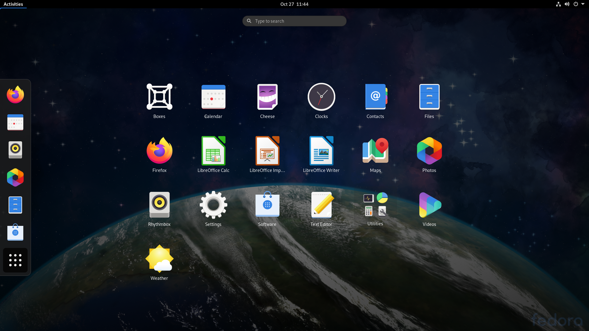

# Linux
Created by <i class="fab fa-telegram"></i>
[edme88]("https://t.me/edme88")

---
<!-- .slide: style="font-size: 0.60em" -->

## Temario

### Linux
* Definición
* Ventajas
* Distribuciones
* Cronología de Distribuciones
* Requisitos mínimos

[Ejercicio: SO Linux](U1_Linux.html#/18)

---
## ¿Qué es Linux?
**Linux** es el nombre que recibe el núcleo o kernel de este SO. 

Esta basado en UNIX, como otros sistemas operativos (MacOS, FreeBSD, Solaris, etc.)

---
## ¿Por qué Linux?
* Es código abierto
* Configurable
* Developer Friendly
* Multiplataforma
* Mejor Servidor
* Modo Consola

---
## ¿Por qué Linux?
* Dedicado a Redes
* Multi Plataforma
* Sigue Estandares

---
## ¿Que es una Distribución de Linux?

---
### ¿Qué Distro Elegir?
#### Para uso normal
* [Kubuntu](https://kubuntu.org/getkubuntu/)
* [Mint](https://linuxmint.com/download.php)
* [Fedora](https://getfedora.org/es/) o [Suse](https://www.suse.com/es-es/products/)

---
### ¿Qué Distro Elegir?
#### Para Trabajar
* [RetHat](https://developers.redhat.com/products/developertoolset/download)/[Fedora](https://getfedora.org/es/)/[Suse](https://www.suse.com/es-es/products/)
* [Debian](https://www.debian.org/distrib/index.es.html)/[Kubuntu](https://kubuntu.org/getkubuntu/)/[Ubuntu](https://ubuntu.com/download/desktop)

---
### ¿Qué Distro Elegir?
#### Para PowerUsers!
* [Gentoo](https://www.gentoo.org/downloads/)
* [Arch](https://archlinux.org/download/)
* [Debian](https://www.debian.org/distrib/index.es.html)

---
### ¿Qué Distro Elegir?
#### Para el Router de casa!
* [OpenWRT](https://openwrt.org/downloads)
* [DD-WRT](https://dd-wrt.com/)

---
## Linux Embebido: [RPi](https://www.raspberrypi.com/software/) ó [TwisterOS](https://twisteros.com/download.html)

---
## Linux Embebido
## [OpenWRT](https://openwrt.org/downloads)

---

---
## Breve Cronología de Distribuciones
[Cronologia de Versiones + Completa](https://upload.wikimedia.org/wikipedia/commons/1/1b/Linux_Distribution_Timeline.svg)

---
## Requisitos mínimos de
## Debian 6
* Año: 2012
* Procesador Pentium 4 - 1 GHz
* 128 MB - 256 MB de RAM
* 2 GB (sin escritorio) - 10 GB (con escritorio) de espacio disponible en disco duro
* Tarjeta gráfica que soporte resolución 800x600

---
## Debian 6

---
## Requisitos mínimos de
## Ubuntu 11.10
* Año: 2011
* Procesador de 32bit (x86) a 1GHz
* 1GB de RAM
* 15 GB de espacio disponible en disco duro
* Tarjeta gráfica que soporte resolución 800x600

---
## Ubuntu 11.10

---
## Requisitos mínimos de
## Fedora 33
* Año: 2020
* Procesador 1 GHz
* 4 GB de RAM
* 20-30 GB de espacio disponible en disco duro
* Tarjeta gráfica compatible con VGA

---
## Fedora 33

---
## Entornos de Escritorio
* **Gnome**: Entorno de Modelo de Objeto de Red GNU
* **KDE**: Entorno de Escritorio del K
* **XFCE**: Entorno Común de XForms
* **LXDE**: Entorno de escritorio X11 ligero
* **Unity**
* **Cinnamon**
* **Mate**
* **Budgie**
* **Pantheon**

---
## GNOME

---
## KDE

---
## XFCE

---
## LXDE

---
## [Entornos de Escritorio](https://computerhoy.com/noticias/software/entornos-escritorio-linux-cual-es-mejor-64586)
#### Parecido a Windows
Tienen un panel en el que se van acumulando los programas abiertos.
* Mate
* XFCE
* Cinnamon
* LXDE

---
## Entornos de Escritorio
#### Parecido a macOS
Posee un **dock** para acceder a las apps y funciones principales.
* Pantheon
* Unity
* Budgie
* Gnome

---
## Entornos de Escritorio
#### Menor consumo de recursos
* LXDE
* XFCE
* Mate
* Pantheon

---
## Ejercicio: SO Linux
**Instale** alguna distribución de Linux, como Ubuntu o Mint, en una computadora o máquina virtual.

Descarga SO:
[Ubuntu 21](https://ubuntu.com/download/desktop)
[Mint 21](https://linuxmint.com/download.php)

Descarga Máquina Virtual: 
[VirtualBox](https://www.virtualbox.org/)

---
## Ejercicio: SO Linux
<iframe width="560" height="315" src="https://www.youtube.com/embed/xHPRv0-OXuM" frameborder="0" allow="accelerometer; autoplay; clipboard-write; encrypted-media; gyroscope; picture-in-picture" allowfullscreen></iframe>

---
### Comandos útiles de Linux
| Comandos        | Explicación                   |
|-----------------|-------------------------------|
| sudo            | Permisos de root              |
| apt-get install | Permite instalar paquetes     |
| cd              | navegar por archivos\carpetas |
| ls              | listar contenido de carpeta   |
| mkdir           | Crear carpetas                |
| grep            | buscar palabra en archivo     |

---
## ¿Dudas, Preguntas, Comentarios?

