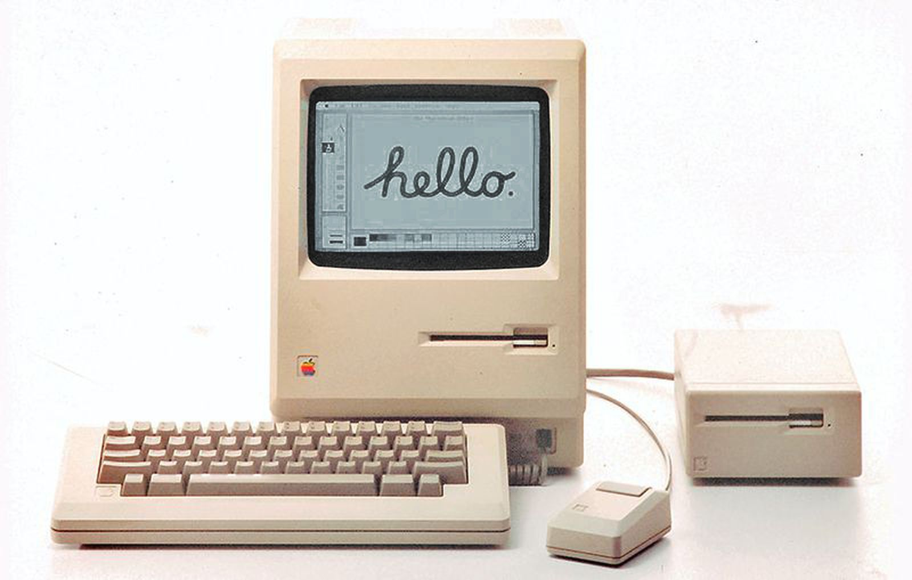
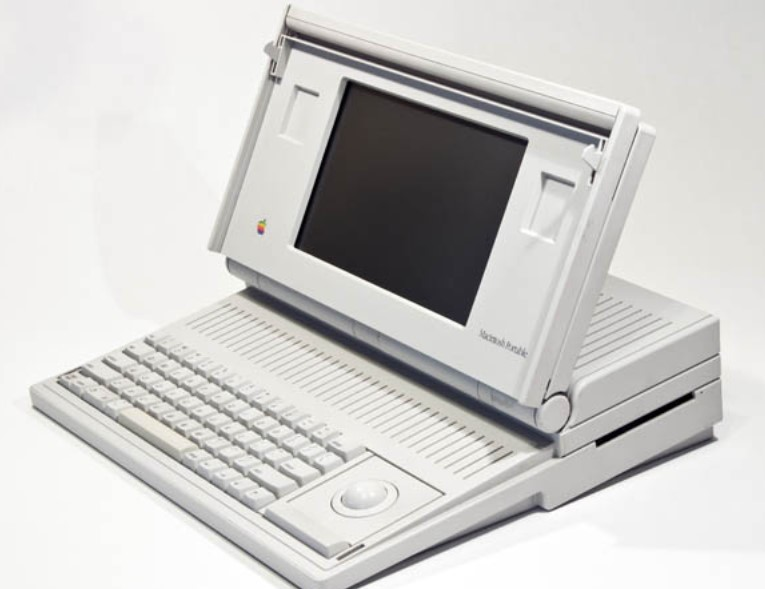
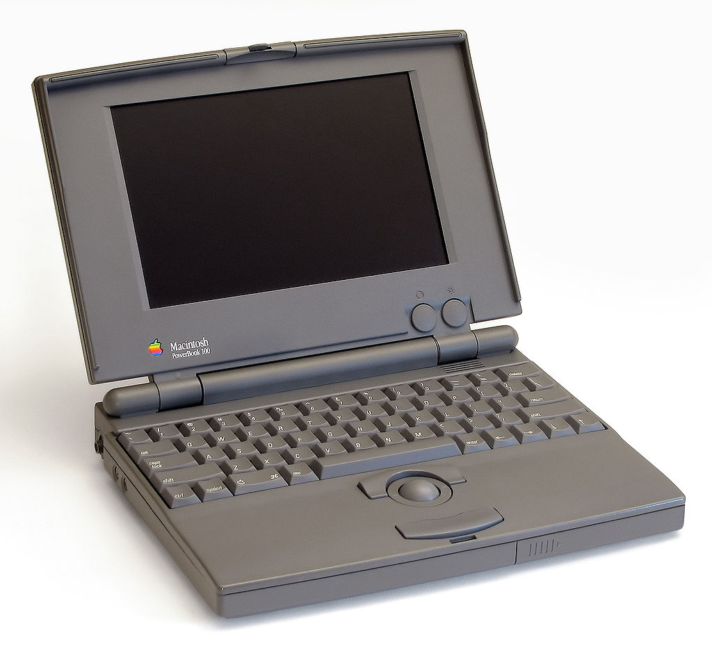
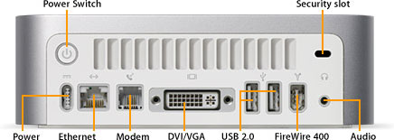

# Mac
Created by <i class="fab fa-telegram"></i>
[edme88]("https://t.me/edme88")

---
<!-- .slide: style="font-size: 0.60em" -->

## Temario

### Mac
* Definición
* Ventajas
* Desventajas

---
## Mac
Sistema operativo diseñado por Apple que está instalado en todos los equipos creados por la compañía Apple Inc.

Esto implica que el hardware y el software son totalmente compatibles (a diferencia de windows, que puede ser usado en equipos de diferentes fabricantes (Dell, Lenovo, Bangho, Acer, Asus, etc)

---
## Breve Historia
)

---
#### 1984: 1 Macintosh

---
#### 1989: Mac Portable

---
#### 1991: PowerBook

---
#### 2005: Mac Mini

---
### Ventajas
* Alto rendimiento
* Diseño cuidado
* Software y Hardware dedicado
* Alta productividad
* Pocos virus

---
### Desventajas
* Precio elevado
* Centro de atención y soporte no tan accesible
* Equipos no ampliables
* No "sirven" para jugar

---
## ¿Dudas, Preguntas, Comentarios?

