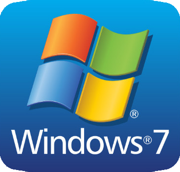
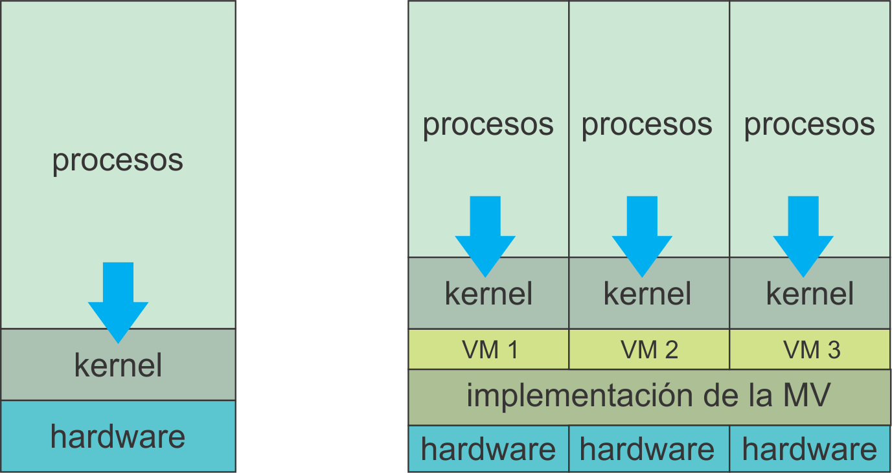

# Sistemas Operativos
<small>
Created by <i class="fab fa-telegram"></i>
[edme88]("https://t.me/edme88") & 
<i class="fab fa-telegram"></i>
[rmarku]("https://t.me/rmarku")
</small>

---
## Sistema Operativo
    
Es un programa que administra el Hardware de una computadora. 
Proporciona las bases para los programas de aplicación y actúa como un intermediario entre el usuario y el hardware.

---
## Sistema Operativo

---
## SO: Tareas
Las tareas que hace un SO son:
* Realizar el interfaz Sistema-Usuario
* Compartir los recursos de Hardware entre los usuarios
* Permitir a los usuarios comaprtir sus datos entre ellos
* Prevenir que las actividades de un usuario no interfieran en las de los demás usuarios
* Calendarizar los recursos de los usuarios
* Facilitar el acceso a los dispositivos de E/S
* Recuperarse de fallas o errores
* Llevar el control sobre el uso de los recursos

---
##  [Ejemplos de Sistema Operativo](http://gs.statcounter.com/os-market-share)
//data-background="images/configSO/OtrosOS.png" data-background-size="50%"
Para PC:
* Solaris
* Linux
* Windows 7
* Mac OS X
* FreeBSD

Para dispositivos móviles:
* Android
* Windows phone
* iOS
* Blackberry

---
## Criterios para Definir SO
* Tipo de Interfaz
  * Gráfica (GUI)
  * Línea de comandos
* Cantidad de tareas
  * Multitarea
  * Monotarea
* Cliente o Servidor</li>
* Tipo de Licencia
  * Propietario
  * Libre

---
## Recursos de Hardware
Los SO requieren ciertos recursos de Hardware para funcionar:
1. Memoria RAM
2. Espacio disponible en Disco Duro
3. Tipo y velocidad del procesador
4. Resolución de video

---
## Hardware: Mínimo y Recomendado
Con la configuración del hardware <b>mínima</b> el rendimiento del sistema suele ser pobre, ya que el SO sólo podrá ejecutar funciones básicas.

Con la configuración de hardware <b>recomendada</b> el SO funciona a una velocidad adecuada.

---
## Requisitos mínimos de 
## Windows 3.11
* Año: 1990
* Procesador 80386sx o superior (25 MHz)
* 3 MB de ram (se recomienda 4 MB)
* Al menos 6.2 MB de espacio disponible en disco duro (se recomienda 14.5 MB)

---
## Requisitos mínimos de
## Windows NT Server
* Año: 1993
* Procesador de 32 bits basado en intel x86: 80486 a 33 Mhz o superior
* 16 MB de memoria ram
* Al menos 125 MB de espacio disponible en disco duro
* adaptador de pantalla de video con resolución VGA o superior
   
---
## Requisitos mínimos de
## Windows 95
* Año: 1995
* Procesador 386DX 33 MHz o superior
* Mínimo 4 MB de RAM (de preferencia 8 MB)
* Mínimo 55 Mb de espacio disponible en disco duro
* 1 unidad de disco de alta densidad de 3,5 pulgadas
* Resolución VGA o superior (se recomienda SVGA de 256 colores)

---
## Requisitos mínimos de
## Windows 98
* Año: 1998
* Procesador 486DX de 66 MHz o superior
* Mínimo 16 MB de RAM (de preferencia 24 MB)
* 120 a 295 MB de espacio disponible en disco duro
* 1 unidad de disco de alta densidad de 3,5 pulgadas
* Resolución VGA o superior (se recomienda SVGA de 256 colores)
* Internet (MSN, Mensajeria): Modem 14,4 bits por segundo (bps),recomendado 28,8 bits o más rapido

---
## Requisitos mínimos de
## Windows XP
* Año: 2001
* Procesador Pentium 233 MHz o superior (de preferencia de 300 HMz)
* Mínimo 64 MB de RAM (de preferencia 128 MB)
* Mínimo 1,5 GB de espacio disponible en disco duro
* Tarjeta gráfica y monitor de resolución Súper VGA (800x600) o superior

---
## Requisitos mínimos de
## Windows 7
* Año: 2007
* Procesador de 32bit o 64bits a 1GHz o más
* 1GB de RAM para 32bits, o 2GB de RAM para 64bits
* 16GB de espacio disponible en disco duro para 32bits, o 20GB para 64bits
* Dispositivo gráfico DirectX9.

---
## Requisitos mínimos de
## Windows 10
* Año: 2015
* Procesador de 32bit o 64bits a 1GHz o más
* 1GB de RAM para 32bits, o 2GB de RAM para 64bits
* 16GB de espacio disponible en disco duro para 32bits, o 20GB para 64bits
* Dispositivo gráfico DirectX9.

<!---https://www.xataka.com/especiales/maquinas-virtuales-que-son-como-funcionan-y-como-utilizarlas-->

---
## Máquina Virtual
Es un software que simula a un computadora y puede ejecutar programas.
Se puede configurar para que los procesos que ejecutan están limitados por los recursos proporcionados.
Habitualmente se usa para ejecutar sistemas operativos y "probarlos".

---
## Máquina Virtual

---

---
## Máquina Virtual: Características
* La MV no puede acceder al resto de datos de la máquina anfitrion.
* Para funcionar, una MV mapea los dispositivos virtuales que ofrece a su invitado con los dispositivos reales presentes en la máquina física.
* Copias de Seguridad y Clonación
* Crear entornos de prueba

---
## Máquina Virtual: Ventajas
* Probar sistemas operativos
* Ejecutar programas antiguos
* Usar software que no esta disponible en nuestro SO
* Probar una aplicación en distintos sistemas
* Copias de Seguridad y Clonación
* Crear entornos de prueba

---
## Máquinas Virtuales: Aplicaciones
* VMWare
* Virtual Box
* Qemu
* Parallels

---
Linea 369
