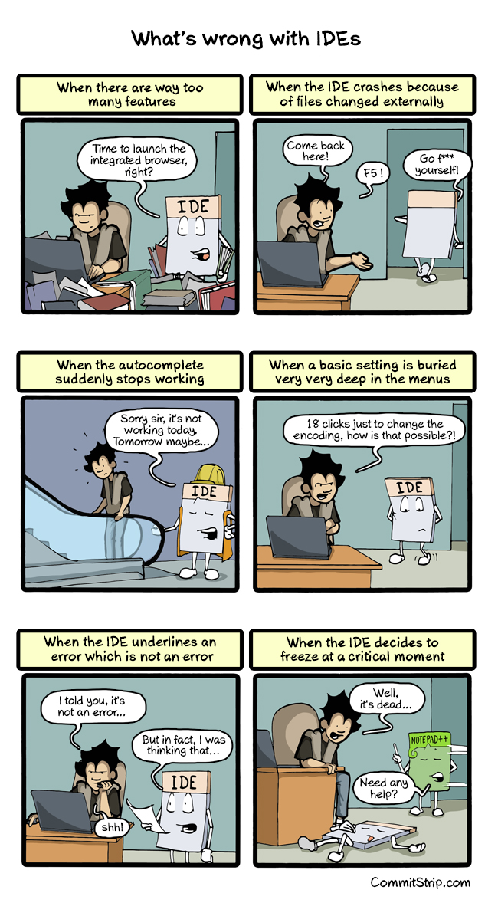
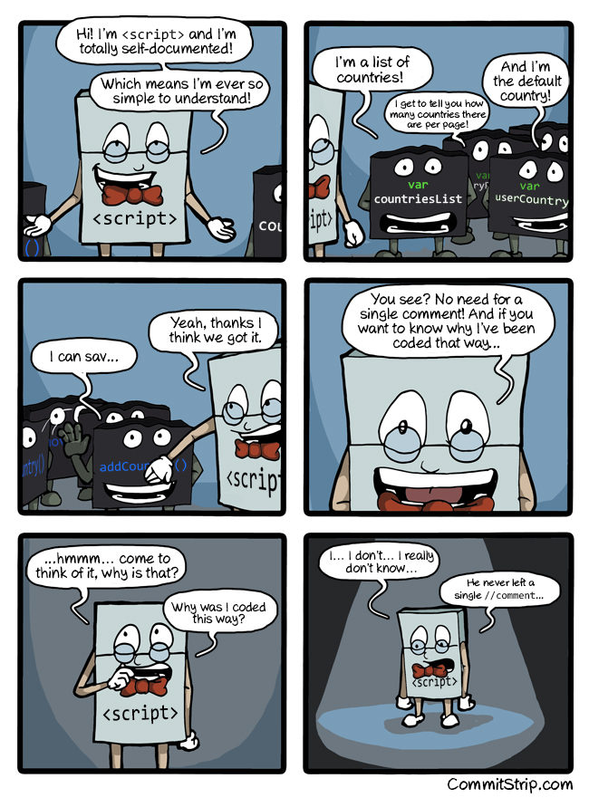

# Herramientas de Desarrollo
<small>
Created by <i class="fab fa-telegram"></i>
[edme88]("https://t.me/edme88") & 
<i class="fab fa-telegram"></i>
[rmarku]("https://t.me/rmarku")
</small>

---


---
## Herramientas de Desarrollo
Permiten agilizar el proceso de desarrollo de Software.

Una aplicacion o programa puede contar con multiples herramientas que se encarguen de funciones especificas y afines para realizar una tarea.

---
## Tipos de Herramientas
* IDE
* Sistema de Control de Versiones
* Bug Tracker
* Pruebas de desempeño, carga, stress
* Documentación


---
## Ambiente de Desarrollo Integrado o IDE
Es un software que proporciona servicios integrales para facilitarle al programador el desarrollo de software.

---
## Ambiente de Desarrollo Integrado o IDE
Normalmente, un IDE consiste de:
* Editor de código fuente
* Herramientas de construcción automáticas
* Depurador o Debugger
* Compilador
* Intérprete

---
## Editor de código fuente
Es un procesador de textos orientado para escribir código fuente de aplicaciones en general en lenguajes de programación.

Generalmente los editores de código soportan varios lenguajes y son capaces de abrir varios archivos a la vez, resaltar su sintaxis y ofrecer ayudas contextuales a la hora de escribir o visualizar el código de las aplicaciones.

---
## Depurador o Debugger
Permite probar y eliminar los errores del programa.

El depurador permite detener el programa en un punto determinado o en un momento determinado para que el usuario pueda examinar y modificar la memoria y las variables del programa, cambiar punto de ejecución, ejecutar una instrucción o partes determinadas de código.

---
## Compilador
Traduce del lenguaje de programación al lenguaje maquina, código intermedio o texto.

* **Lenguajes compilados:** C, C++, Fortran, Pascal, Visual Basic.
* **Lenguajes interpretados:** Python, JavaScript, HTML, Ruby, PHP.

---


---
## Interprete
Realiza la traducción a medida que sea necesaria, instrucción por instrucción y no guardan el resultado de la traducción.

Los programas interpretados suelen ser más lentos que los compilados debido a la necesidad de traducir el programa mientras se ejecuta, pero son más flexibles permitiendo reemplazar partes del programa.

Uno de los entornos más comunes de uso de los intérpretes es en los navegadores web, debido a que se ejecutan independientemente de la plataforma.

---
<!data-background="images/herramientas/IDES.png"-->
## IDE's
Ejemplos de IDE's para desarrollo Web:
* Eclipse
* Net Beans
* JetBrains Web Storm
* Aptana
* Dreamweaber
* Microsoft Visual Studio Express for Web
* Sublime Text
* NotePad ++

---
<data-background="images/herramientas/Busydesk-desarrollo.png">
## IDE's
No hay mejor IDE que aquel que cumpla con tus expectativas y supla tus necesidades y requerimientos.

---


---
## Gestión de Versiones o VCS
Permiten gestionarlos archivos de un proyecto (y sus versiones) y que sus integrantes puedan acceder remotamente a ellos.

---
## Gestión de Versiones o VCS
Los usuarios pueden:
* Descargar los archivos
* Modificar archivos
* Publicar cambios
* Volver a versiones anteriores
* Ramificar a partir de una versión
* Aplicar cambios de distintas versiones

---
<data-background="images/herramientas/subversionado.png">
## Ventajas de VCS:
* Permite llevar cuenta de los cambios de un conjunto de archivos digitales en el tiempo
* Cada versión registrada en el tiempo es una revisión
* Permite tanto a un desarrollador como a un grupo de desarrolladores, gestionar el código del proyecto.

---
## Herramientas de VCS
* Git
* SVN
* Mercurial
* Bazaar

---
## Documentación de Código
   
Permite:
* Entender que se está haciendo y porqué
* Mantener el código


---
## Niveles de Documentación
* **por clase:** descripción,autor,fecha y ultima modificación
* **por método:** descripción del objeto, funcionalidades, parámetros y resultados
* **de variables:** que sean importantes o difíciles de entender
* **de limitaciones**
* **de algoritmos implementados**

---
## Formato de Documentación (JSDoc)
```javascript
/**
   * @fileoverview Librería con funciones de utilidad
   * @author Jose
   * @version 0.1
   */
   /**
   * Muestra un mensaje de texto
   * @param {String} método nombre del método
   * @param {String} mensaje mensaje a mostrar
   * @returns {integer} el codigo de retorno 0
   */
   function trazas(metodo, mensaje){
       alert("["+metodo+"]:"+mensaje);
       return 0;
   }
```

---


---
## Documentación...A tener en cuenta
* No uses solo una linea, divídela en párrafos para que sea mas legible
* Tabular los comentarios de lineas consecutivas
* No comentar obviedades
* Se profesional (No insultes o coloques frases fuera de contexto)
* Revisa la ortografía

---
## Documentación...A tener en cuenta
* No comentes si no es necesario
* Comentarios simple y directo
* Documenta mientras desarrollas
* Manten los comentarios actualizados

---
````javascript
return 1; # returns 1
stop(); // Hammertime!
long long ago; /* in a galaxy far far away */
//This code sucks, you know it and I know it.
//Move on and call me an idiot later.
/////////////////////////////// this is a well commented line
// I don't know why I need this,
//but it stops the people being upside-down
x = -x;
````

[más ejemplos](http://stackoverflow.com/questions/184618/what-is-the-best-comment-in-source-code-you-have-ever-encountered%3E)

---


---
## Bug Tracker o BTS
Para asegurar una buena calidad en los proyectos de dimension considerable es importante utilizar un Bug Tracker para realizar el seguimiento de los defectos o Bugs que surgen y son detectados.

---
## Ejemplos de Bug Tracker
* Jira
* Bugzilla
* Flyspray
* Trac
* The bug Genie
* MantisBT
 
---


---


---


---


---
## Prueba de Desempeño o Performance
* **Load Test:** Simular la realidad a la que esta expuesto el sistema cuando este en produccion.
* **Stress Test:** Simula mas carga de la esperada.
* **Endurance o Resistencia:** Desempeño del sistema después de una carga duradera por un periodo de tiempo largo.
               
---
## Herramienta para Stress Test
* Apache JMeter
* WebLOAD
* LoadUI NG Pro
* SmartMeter.io
* LoadRunner
* Appvance
* NeoLoad
* LoadComplete

---


---


---


---
## Integración Continua
Es una buena practica generar tests para verificar el correcto funcionamiento de las partes del software.
Estos test pueden ser manuales (los realiza una persona según un documento) o automáticos (código que prueba otro código).
En el caso de los test automatizados, se recurre muchas veces a servidores que corran los test, para poder correrlos en distintos ambientes. A estos servidores se les llama de Integración Continua.

---
## Herramienta para Integración Continua
### Propio servidor
* GitLab CI
* Jenkins
* Drone.io

### Cloud
* Travis.ci
* Codeship
* CircleCI

---
[Ejemplo de Construccion con Travis de las filminas](https://travis-ci.org/UCC-LabCompu2/filminas)

---


---


---


---
[](https://en.wikipedia.org/wiki/Build_light_indicator)

---
## IDE WebStorm
[](https://www.jetbrains.com/webstorm/)

**Empresa:** JetBrains

Pago pero gratuito para Alumnos

---
[](http://stackoverflow.com)

---
## ¿Dudas, Preguntas, Comentarios?

