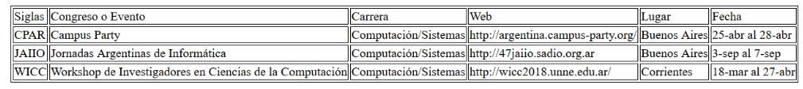

# Tutorial de HTML
### en HTML (que recursivo :P)
<small>
Created by <i class="fab fa-telegram"></i>
[edme88]("https://t.me/edme88") & 
<i class="fab fa-telegram"></i>
[rmarku]("https://t.me/rmarku")
</small>

---
## Estructura Básica


---
## Contenido Minimo


---
## Sintaxis


---
## ¿Cómo Comenzar?


---
## Etiquetas
* **&lt;title&gt; y &lt;/title&gt;:** Se muestra en la barra de título del navegador, al hacer un marcador a la página o en los buscadores de Internet.

* **&lt;meta&gt; y &lt;/meta&gt;:** No son imprescindibles, pero permiten identificar algunos parámetros de la web, como autores, codificación de caracteres, etc.

---
## Github Classroom

[Github Classroom](https://classroom.github.com/a/D62pXDcP)

---
## Ejercicio: Primer HTML
* Crear un archivo HTML
* Incluir la etiqueta &lt;head&gt;
* Incluir datos del autor, descripcion y palabras principales

---
## Etiquetas Semántica
Etiquetas que dan un significado a las partes del documento, indican qué contenido engloban y cuál es su relación con el conjunto de elementos del documento HTML.

---
## Estructura Semántica


---
## Estructura Semántica
* **Header:** Especifica un encabezado de un documento o sección.
* **Nav:** Define un conjunto de enlaces de navegación.
* **Aside:** Define un contenido que se coloca como una barra lateral.
* **Section:** Define una sección de un documento. (Ejemplo, introducción, contenido, contacto)
* **Article:** Especifica contenido independiente. Debe tener sentido por sí mismo. (Ejemplo mensaje foro, entrada blog, articulo periodico)
* **Footer:** Especifica un pie de página de un documento o sección.

---
## Cuerpo de la Página
````html
<body>
<header>
    <section>
        Logo de la Página + Titulo de la Página
    </section>
</header>
<footer>
    Este es el pie de Pagina
</footer>
</body>
````

---
## CABECERA
````html
<header>
    
    <h1>NOMBRE DE LA PAGINA</h1>
</header>
````

---
## [Tipos de Texto](https://www.w3schools.com/html/html_formatting.asp)
````html
<p>Esto es un párrafo</p>
<p>Esto es un párrafo con un <span>span</span></p>
<b>Esto es Negrita</b>
<i>Esto es Cursiva</i>
<u>Esto es un Subrayado</u>
2<sup>3</sup>=8
Ozono= O<sub>3</sub>
````
<p>Esto es un párrafo</p>
<p>Esto es un párrafo con un <span>span</span></p>
<b>Esto es Negrita</b>
<i>Esto es Cursiva</i>
<u>Esto es un Subrayado</u>
2<sup>3</sup>=8
Ozono= O<sub>3</sub>

---
## Ejercicio: Secciones
Incluir en la pagina 3 secciones:
* Un &lt;header&gt; con imagen y titulo
* Un texto con párrafos. Debe incluir estilos (negrita, itálica y subrayado).
* Un &lt;footer&gt; con el nombre de los autores de la pagina

---
## Para realizar pruebas...
[](https://jsfiddle.net/)

---
## Tipos de Listas
* Ordenadas
* No Ordenadas

---
## Listas Ordenadas
````html
<ol>
    <li>Item uno</li>
    <li>Item dos</li>
    <li>Item 3</li>
</ol>
````    
1. Item uno
2. Item dos
3. Item 3

---
## Listas No Ordenadas
````html
<ul>
    <li>Item uno</li>
    <li>Item dos</li>
    <li>Item 3</li>
</ul>
````
<ul>
    <li>Item uno</li>
    <li>Item dos</li>
    <li>Item 3</li>
</ul>

---
## Hipervinculo
````html
<a href="http://www.w3schools.com/tags/tag_a.asp" target="_blank">
    Soy un Hipervinculo xD
</a>
<br>
<a href="mailto:edmealiciardi@gmail.com">
    edmealiciardi@gmail.com
</a>
````
<a href="http://www.w3schools.com/tags/tag_a.asp" target="_blank">
    Soy un Hipervinculo xD
</a>
<br>
<a href="mailto:edmealiciardi@gmail.com">
    edmealiciardi@gmail.com
</a>

---
## Ejercicio: Listas
* Crear otra página HTML con un párrafo de texto.
* El parrafo debe contener al menos una lista no ordenada
* El parrafo debe contener al menos una lista ordenada
* En la web principal incluir &lt;nav&gt; y un link a la web creada.

---
## Tablas
````html
<table>
    <thead>
    <tr>
        <th>Asignatura</th>
        <th>Nota</th>
    </tr>
    </thead>
    <tbody>
    <tr>
        <td>Analisis Matematico</td>
        <td>8</td>
    </tr>
    <tr>
        <td>Fisica I</td>
        <td>9</td>
    </tr>
    <tr>
        <td>Laboratorio de Computacion I</td>
        <td>8</td>
    </tr>
    </tbody>
</table>
````
---
## Tablas
<table style="border: 2px solid white">
    <thead>
    <tr>
        <th>Asignatura</th>
        <th>Nota</th>
    </tr>
    </thead>
    <tbody>
    <tr>
        <td>Analisis Matematico</td>
        <td>8</td>
    </tr>
    <tr>
        <td>Fisica I</td>
        <td>9</td>
    </tr>
    <tr>
        <td>Laboratorio de Computacion I</td>
        <td>8</td>
    </tr>
    </tbody>
</table>

---
## Ejemplos de Tablas y bordes
[Tablas y CSS](https://mosaic.uoc.edu/ac/le/es/m6/ud7/index.html)

[W3School](https://www.w3schools.com/css/css_table.asp)

[LibrosWeb](http://librosweb.es/libro/css/capitulo_10.html)

---
## Ejercicio: Tablas I
Cree una tabla con la siguiente estructura:



---
## Ejercicio: Tablas II
Cree una tabla con la siguiente estructura:
* Utiliza el atributo colspan


---
## Ejercicio: Tablas III
Cree una tabla con la siguiente estructura:
* Utiliza el atributo rowspan


---
## Ejercicio: Comentarios
Agrege comentarios a la página web de tablas.

````html
<!--Esto es un comentario-->
````
---
## Div
````html
<div>
    Contenido de la Caja
</div>
````

<div>
    Contenido de la Caja
</div>

---
## DIV
* **&lt;div&gt;:** Define un bloque de contenido o sección de la página, para poder aplicarle diferentes estilos o para realizar operaciones sobre ese bloque específico.
        


---
## Buenas Practicas
* Cerrar las etiquetas
* Nombre de las etiquetas siempre en minúscula
* Poner comillas a todos los atributos
* Validar el código
* Identar el código correctamente
* Tener en cuenta la accesibilidad (alt, title para img-label para inputs)
* No utilizar etiquetas deprecadas
* Usar ficheros externos para CSS y JavaScript

---
## Elementos para Formularios
````html
<form id="form1">

</form>
````

---
## Input Text
````html
<input type="text" name="nombre"/>
<input type="password" name="psw">
<input type="email" name="email">
````

<input type="text" name="nombre"/>
<input type="password" name="psw">
<input type="email" name="email">

---
## Ejercicio UI: Conversor de Unidades


---
## Ejercicio UI: Operaciones Matemáticas


---
## Input Radio
````html
<input type="radio" name="gender" value="male" checked> Male<br>
<input type="radio" name="gender" value="female"> Female
````
<input type="radio" name="gender" value="male" checked> Male<br>
<input type="radio" name="gender" value="female"> Female

---
## Ejercicio UI: Mostrar/Ocultar Div
Cree la UI para posteriormente agregar funciones JavaScript que permitan mostrar u ocultar un div.
* Debe emplear un <input type="radio">


---
## Input Select
````html
<select name="materias">
    <option value="analisisMat">Análisis Matemático</option>
    <option value="algebra">Álgebra</option>
    <option value="program1">Programación I</option>
    <option value="labCompu2">Laboratorio de Computación II</option>
</select>
````
<select name="materias">
    <option value="analisisMat">Análisis Matemático</option>
    <option value="algebra">Álgebra</option>
    <option value="program1">Programación I</option>
    <option value="labCompu2">Laboratorio de Computación II</option>
</select>

---
## Input Button
````html
<button type="button">Click Me!</button>
````
<button type="button">Click Me!</button>

---
## Input Range
````html
<input type="range" id="a" name="a" value="50">
````
<input type="range" id="a" name="a" value="50">

---
## Input Checkbbox
````html
<input type="checkbox" name="materia1" value="Matematica"> Matematica<br>
<input type="checkbox" name="materia2" value="Lengua"> Lengua
````
<input type="checkbox" name="materia1" value="Matematica"> Matematica<br>
<input type="checkbox" name="materia2" value="Lengua"> Lengua

---
## Input Number
````html
<input type="number" name="points" min="0" max="100" step="10" value="30">
````
<input type="number" name="points" min="0" max="100" step="10" value="30">

---
## Fieldset, Legend y Label
````html
<fieldset>
    <legend>Persona:</legend>
    <label for="nombre"> Nombre:</label>
    <input type="text" size="30" id="nombre"><br>
    <label for="email"> Email:</label>
    <input type="text" size="30" id="email">
</fieldset>
````
<div align="left">
    <fieldset style="border: 5px white solid;padding: 20px">
        <legend>Personalia:</legend>
        Name: <input type="text" size="30" style="margin-left: 110px"><br>
        Email: <input type="text" size="30" style="margin-left: 110px">
    </fieldset>
</div>

---
## [Nuevos Campos de HTML 5.1](https://lenguajehtml.com/p/html/formularios/controles-campos-fecha-hora)

* Fecha
* Hora
* Fecha y hora local
* Mes
* Semana

````html
<input type="date">
<input type="time">
<input type="datetime-local">
<input type="month">
<input type="week">
````

---
## Accesibilidad
La accesibilidad web tiene como objetivo lograr que las páginas web sean utilizables por el máximo número de personas, independientemente de sus conocimientos o capacidades personales.

[Accesibilidad Web](http://accesibilidadweb.dlsi.ua.es/?menu=guiabreve-1)

---
## Accesibilidad: Consejos
* Use el atributo **alt** en las **imágenes** para describir la función del elemento visual.
*  Use el elemento map para las zonas activas.
*  Emplee programas **lector de pantalla** (JAWS, NVDA, ETC) para comprobar el correcto funcionamiento de la web. (Fangs Screenenders muestra una version de texto de la pagina web)
*  Utilice correctamente los hipervinculos (deben tener sentido por si mismo. No emplear 'Click Aqui')
*  Utilice encabezados, listas y estructura de manera consistente
*  Describir figuras, diagramas o animaciones con el atributo longdesc
*  Emplee el tag &ltcaption&gt para los titulos de las tablas
*  Utilice herramientas o servicios como [Accesibility Validator W3](https://validator.w3.org/) para comprobar el adecuado funcionamiento de la página

---
## Lienzo Canvas
Proporciona una Interfaz de Programación de Aplicaciones (API) para dibujar líneas en dos dimensiones, imágenes y textos.

El lienzo es un contenedor de gráficos y se debe utilizar un script para dibujar o pintar.

Cada pixel dentro del lienzo(canvas) puede ser controlado.

---
## Lienzo Canvas
````html
<canvas id="myCanvas" width="200" height="100" style="border:1px solid #d3d3d3;">
    Your browser does not support the HTML5 canvas tag.
</canvas>
````
<canvas id="myCanvas" width="200" height="100" style="border:1px solid #d3d3d3;">
    Your browser does not support the HTML5 canvas tag.
</canvas>

---
## Multimedia
HTML5 permite incluir audio y video de forma nativa sin incluir pluing de terceros.
    
Para los navegadores que no soporten esta tecnología, se pueden incluir textos que indiquen que es incompatible.
    
---
## Video
````html
<video src="http://v2v.cc/~j/theora_testsuite/320x240.ogg" controls>
    Tu navegador no implementa el elemento <code>video</code>.
</video>
````
<video src="http://v2v.cc/~j/theora_testsuite/320x240.ogg" controls>
    Tu navegador no implementa el elemento <code>video</code>.
</video>

---
## Audio
````html
<audio src="/test/audio.ogg" controls autoplay>
<p>Tu navegador no implementa el elemento audio.</p>
</audio>
````
<audio src="/test/audio.ogg" controls autoplay>
    Tu navegador no implementa el elemento audio.</p>
</audio>

---
## Consejos
[Google WebMasters](http://www.google.es/webmasters/learn/)

---
## Verifica tu Web
[W3C Markup Validation Service](https://validator.w3.org/#validate_by_input)

---
# Bibliografia xD
[](http://www.w3schools.com/html/U4_HTML.html)

[](https://developer.mozilla.org/es/)

---
## Github Classroom: Proyecto Integrador
[Primer Parcial](https://classroom.github.com/g/bkDwNLv8)

---
## ¿Dudas, Preguntas, Comentarios?

