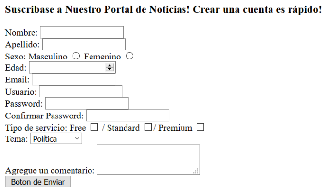

# Tutorial de HTML II
### en HTML (que recursivo :P)
<small>
Created by <i class="fab fa-telegram"></i>
[edme88]("https://t.me/edme88") & 
<i class="fab fa-telegram"></i>
[rmarku]("https://t.me/rmarku")
</small>

---
## Formulario
Es un documento que nos permite rellenar información de forma ordenada y estructurada. 

Algunos ejemplos podrían ser escribir nuestro nombre y apellidos, dirección, cuenta de email, etc.

---
## Formularios
Los elementos y atributos para formularios en HTML5 proveen un mayor grado de marcado semántico que en HTML4 y eliminan 
gran parte del tedioso trabajo de programar y diseñar que se necesitaba en HTML4. 

Las funcionalidades de los formularios en HTML5 brindan una experiencia mejor para los usuarios al permitir que los 
formularios tengan un comportamiento más consistente entre diferentes sitios web y al darle una devolución inmediata 
acerca de la información ingresada.

---
## Elementos para Formularios
````html
<form id="form1">

</form>
````
<!-- .slide: style="font-size: 0.70em" -->
Atributos que puede tener:
* action: url donde se envia la información
* method: los datos se envian de forma oculta(post) ó sin condificar(get)
* accept: especifica tipo de archivo que puede subirse al formulario
* enctype: indica como se deben codificar los datos al enviarse al servidor
* autocomplete: controles del formulario que pueden tener sus valores automáticamente completados.
* name: nombre con el que identificamos al formulario.
* novalidate: indica que el formulario no es validado cuando es enviado
* target: Indica dónde mostrar la respuesta, después de enviar el formulario (_self. _blank, _parent, _top)

---
## Input
Campo de texto en una línea
````html
<input type="text" name="nombre"/>
<input type="password" name="psw">
<input type="email" name="email">
<input type="search" name="buscar"/>
<input type="tel" name="telefono"/>
<input type="url" name="pagina_web"/>
````
<input type="text" name="nombre"/>
<input type="password" name="psw">
<input type="email" name="email">
<input type="search" name="buscar"/>
<input type="tel" name="telefono"/>
<input type="url" name="pagina_web"/>

---
## Input Radio
Permiten elegir una sola opción entre un grupo. 
````html
<input type="radio" name="gender" value="male" checked> Male<br>
<input type="radio" name="gender" value="female"> Female
````
<input type="radio" name="gender" value="male" checked> Male<br>
<input type="radio" name="gender" value="female"> Female

---
## Input Select
Permite al usuario elegir de entre un número de opciones de una lista.
````html
<select name="materias">
    <option value="analisisMat">Análisis Matemático</option>
    <option value="algebra">Álgebra</option>
    <option value="program1">Programación I</option>
    <option value="labCompu2">Laboratorio de Computación II</option>
</select>
````
<select name="materias">
    <option value="analisisMat">Análisis Matemático</option>
    <option value="algebra">Álgebra</option>
    <option value="program1">Programación I</option>
    <option value="labCompu2">Laboratorio de Computación II</option>
</select>

---
## Input Button
Crear un botón en el que se puede hacer click sin ningún valor por defecto.
````html
<button type="button">Click Me!</button>
````
<button type="button">Click Me!</button>
Atributos:
* disabled
* autofocus
* autocomplete
* form, etc, ect

---
## Input Range
Permite que el usuario especifique un valor numérico comprendido entre un valor mínimo y máximo
````html
<input type="range" id="a" name="a" value="50">
````
<input type="range" id="a" name="a" value="50">

---
## Input Checkbbox
Casilla de verificación asociada a una opción que puede ser marcado o desmarcado por el usuario.
````html
<input type="checkbox" name="materia1" value="Matematica"> Matematica<br>
<input type="checkbox" name="materia2" value="Lengua"> Lengua
````
<input type="checkbox" name="materia1" value="Matematica"> Matematica<br>
<input type="checkbox" name="materia2" value="Lengua"> Lengua

---
## Input Number
Campo para la entrada de un número.
````html
<input type="number" name="points" min="0" max="100" step="10" value="30">
````
<input type="number" name="points" min="0" max="100" step="10" value="30">

---
## Textarea
Representa un campo para la entrada de texto multilínea.
````html
<textarea name="comentarios" rows="10" cols="40">Escribe aquí tus comentarios</textarea>
````
<textarea name="comentarios" rows="10" cols="40">Escribe aquí tus comentarios</textarea>

---
## Placeholder
Atributo de elementos input y textarea para representar una indicación que ayude al usuario a completar estos campos.
````html
<input name="nombre" placeholder="Ingrese nombre">
````
<input name="nombre" placeholder="Ingrese nombre">

---
## Ejercicio: Formulario
<!-- .slide: style="font-size: 0.50em" -->
Empleando el template “ej_formulario”, agregue las siguientes etiquetas:
* **form** para agrupar todos los campos
* **input** tipo texto, radio, numero, email, password, checkbox y submit
* **select y option** para el selector
* **textareae**
* Atributo **placeholder** en todos los inputs



---
## Fieldset, Legend y Label
````html
<fieldset>
    <legend>Persona:</legend>
    <label for="nombre"> Nombre:</label>
    <input type="text" size="30" id="nombre"><br>
    <label for="email"> Email:</label>
    <input type="text" size="30" id="email">
</fieldset>
````
<div align="left">
    <fieldset style="border: 5px white solid;padding: 20px">
        <legend>Personalia:</legend>
        Name: <input type="text" size="30" style="margin-left: 110px"><br>
        Email: <input type="text" size="30" style="margin-left: 110px">
    </fieldset>
</div>

---
## [Nuevos Campos de HTML 5.1](https://lenguajehtml.com/p/html/formularios/controles-campos-fecha-hora)

* Fecha
* Hora
* Fecha y hora local
* Mes
* Semana

````html
<input type="date">
<input type="time">
<input type="datetime-local">
<input type="month">
<input type="week">
````

---
## Accesibilidad
La accesibilidad web tiene como objetivo lograr que las páginas web sean utilizables por el máximo número de personas, independientemente de sus conocimientos o capacidades personales.

[Accesibilidad Web](http://accesibilidadweb.dlsi.ua.es/?menu=guiabreve-1)

---
## Accesibilidad: Consejos
<!-- .slide: style="font-size: 0.75em" -->
* Use el atributo **alt** en las **imágenes** para describir la función del elemento visual.
*  Use el elemento map para las zonas activas.
*  Emplee programas **lector de pantalla** (JAWS, NVDA, ETC) para comprobar el correcto funcionamiento de la web. (Fangs Screenenders muestra una version de texto de la pagina web)
*  Utilice correctamente los hipervinculos (deben tener sentido por si mismo. No emplear 'Click Aqui')
*  Utilice encabezados, listas y estructura de manera consistente
*  Describir figuras, diagramas o animaciones con el atributo longdesc
*  Emplee el tag &ltcaption&gt para los titulos de las tablas
*  Utilice herramientas o servicios como [Accesibility Validator W3](https://validator.w3.org/) para comprobar el adecuado funcionamiento de la página

---
## Lienzo Canvas
Proporciona una Interfaz de Programación de Aplicaciones (API) para dibujar líneas en dos dimensiones, imágenes y textos.

El lienzo es un contenedor de gráficos y se debe utilizar un script para dibujar o pintar.

Cada pixel dentro del lienzo(canvas) puede ser controlado.

---
## Lienzo Canvas
````html
<canvas id="myCanvas" width="200" height="100" style="border:1px solid #d3d3d3;">
    Your browser does not support the HTML5 canvas tag.
</canvas>
````
<canvas id="myCanvas" width="200" height="100" style="border:1px solid #d3d3d3;">
    Your browser does not support the HTML5 canvas tag.
</canvas>

---
## Multimedia
HTML5 permite incluir audio y video de forma nativa sin incluir pluing de terceros.
    
Para los navegadores que no soporten esta tecnología, se pueden incluir textos que indiquen que es incompatible.
    
---
## Video
````html
<video src="http://v2v.cc/~j/theora_testsuite/320x240.ogg" controls>
    Tu navegador no implementa el elemento <code>video</code>.
</video>
````
<video src="http://v2v.cc/~j/theora_testsuite/320x240.ogg" controls>
    Tu navegador no implementa el elemento <code>video</code>.
</video>

---
## Audio
````html
<audio src="/test/audio.ogg" controls autoplay>
<p>Tu navegador no implementa el elemento audio.</p>
</audio>
````
<audio src="/test/audio.ogg" controls autoplay>
    Tu navegador no implementa el elemento audio.</p>
</audio>

---
## Consejos
[Google WebMasters](http://www.google.es/webmasters/learn/)

---
## Verifica tu Web
[W3C Markup Validation Service](https://validator.w3.org/#validate_by_input)

---
# Bibliografia xD
[](http://www.w3schools.com/html/U4_HTML.html)

[](https://developer.mozilla.org/es/)

---
## ¿Dudas, Preguntas, Comentarios?

