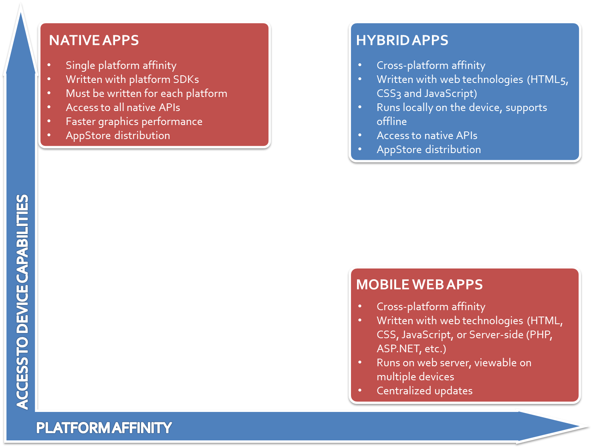

# Unidad 6: Aplicaciones Móviles
<small>
Created by <i class="fab fa-telegram"></i>
[edme88]("https://t.me/edme88") & 
<i class="fab fa-telegram"></i>
[rmarku]("https://t.me/rmarku")
</small>

---
## Aplicaciones Moviles o APP
Son aplicaciones diseñada para ser ejecutadas en teléfonos inteligentes, tablets y otros dispositivos móviles y que permite al usuario efectuar una tarea, facilitando la gestión o actividad a desarrollar.


---
## Ejemplos de Aplicaciones Móviles
* Whatsap
* Telegram
* Instagram
* Opera Mini
* Clash of Clans

---
<!--http://appdesignbook.com/es/contenidos/tipos-de-apps/-- >
---
## Categorías de Aplicaciones
### Según el contenido:</h3>
* Entretenimiento
* Sociales
* Utilitarias y Productividad
* Educativas e Informativas

---
## Categorías de Aplicaciones
### Según el costo:</h3>
* Apps Gratuitas
* Apps de Pago
* Fremium

---
## Características de App
* Capacidad de comunicarse desde cualquier lugar
* Interfaz de usuario para pantalla y teclado pequeno
* Movilidad del dispositivo
* Disponibilidad de muchos sensores

---
## Sistemas Operativos para Dispositivos móviles
* Android
* iOS
* ~~Windows Phone~~
* ~~Blackberry~~
* ~~Ubuntu Phone~~
* ~~Firefox OS~~
* ~~Tizen~~
* Fucshia <small>(comming soon...)</small></br>

---
## Apps Android
* **Lenguaje:** Java o Kotlin + Librerias Android
* **IDE:** Android Studio
* **SO:** Windows, Linux o Mac
* Emuladores de Dispositivos
    
---
## Apps iOS
* **Lenguaje:** ObjetiveC - Swift
* **IDE:** XCode
* **SO:** Mac
* Emuladores de Dispositivos
* Para probarlo en dispositivo, pagar licencia de desarollador

---
<!--
    http://appdesignbook.com/es/contenidos/diseno-visual-apps-nativas/
    http://www.lancetalent.com/blog/tipos-de-aplicaciones-moviles-ventajas-inconvenientes/
    http://www.batanga.com/tech/13241/que-es-apache-cordova
    https://cordova.apache.org/docs/es/latest/guide/overview/
-->

---
## Tipos de Aplicaciones
* Aplicaciones Nativas
* Aplicaciones Web
* Aplicaciones Hibridas


---
## Aplicaciones Nativas
Se desarrolla de forma específica para un determinado sistema operativo, utilizando el Software
Development Kit o SDK de la plataforma.
    
---
## Aplicaciones Nativas
<table style="font-size: 0.7em">
    <tr>
<td>Ventajas</td>
<td>Desventajas</td>
    </tr>
    <tr>
<td>
    <ul>
<li>>Acceso completo al dispositivo</li>
<li>Mejor experiencia del usuario</li>
<li>Visibilidad en APP Store</li>
<li>Envio de notificaciones a los usuarios</li>
<li>La actualización es constante</li>
<li>No requiere conexion a internet</li>
    </ul>
</td>
<td>
    <ul>
<li>Diferentes habilidades/idiomas/herramientaspara cada plataforma de destino</li>
<li>Tienden a ser más caras de desarrollar</li>
<li>El código cliente no es reutilizable entre las diferentes plataformas</li>
    </ul>
</td>
    </tr>
</table>
    </section>

---
## Web APP 
Se ejecutan dentro del propio navegador web del dispositivo a través de una URL. Se desarrollan con HTML, JavaScript y CSS.
    
---
## Web APP
<table style="font-size: 0.7em">
    <tr>
<td>Ventajas</td>
<td>Desventajas</td>
    </tr>
    <tr>
<td>
    <ul>
* El código es reutilizable
* Proceso de desarrollo sencillo y económico
* No Necesita Instalarse
* EL usuario siempre dispone de la ultima version
    </ul>
</td>
<td>
    <ul>
* Requiere conexión a Internet
* Acceso limitado a características de hardware
* Experiencia del ususario más propia de la aplicación web que de la app nativa
* Requiere mayor esfuerzo de promoción
    </ul>
</td>
    </tr>
</table>

---
## Aplicación híbrida
Es una combinación de las aplicaciones nativas y las webapss. Se desarrollan con lenguajes: HTML, Javascript y CSS por lo que permite su uso en diferentes plataformas y el acceso a gran parte de las características del hardware del dispositivo. Es posible distribuirla en app store.
    
---
## Aplicación híbrida
Una vez que la aplicación está terminada, se compila o empaqueta, y el resultado final es como si se tratara de una aplicación nativa.
    
---
<!--http://blog.aplicacionesmovil.com/aplicaciones-celular/desarrollo-de-aplicaciones-hibridas-->

---


---


---


---
## Frameworks Híbridos
* Apache Cordova
* IONIC
* React Native
* Appcelerator Titanium

---
## [Apache Cordova](https://cordova.apache.org/)
Es un framework para desarrollar aplicaciones nativas dentro de un smartphone.
Cuenta con muchas Apis de diversos dispositivos móviles. Permite desarrollar con HTML, JavaScript y CSS
    
---
## Apache Cordova
Permite encapsular CSS, HTML, y código de Javascript dependiendo de la plataforma del dispositivo.
    
Extiende las características de HTML y Javascript para trabajar con el dispositivo.
    
Las aplicaciones resultantes son híbridas ya que están empaquetadas como aplicaciones para su distribución y tienen acceso a las APIs nativas del dispositivo.
    
---
## Ejecución de Cordova
1. Instalar cordova <pre><code>npm install -g cordova</code></pre> 
2. Crear nuevo proyecto <pre><code>cordova create MyApp</code></pre> 
3. Agregar tipo de plataforma <pre><code>cd MyApp cordova platform add android</code></pre> 
4. Conectar un celular con Android (opciones de desarrollador-Depuración de USB) <pre><code>cordova run android</code></pre> 

---
## Ejecución de Cordova 2
1.Abrir el proyecto, y reemplazar el contenido de la carpeta 'www' por un proyecto web
2. Abrir el Android Studio
3. Crear un dispositivo para emular desde 'Tools > Android > AVD Manager'
4. Correr la aplicación en el emulador <pre><code>cordova emulate andorid</code></pre> 

---
## Por qué Android? 
1. Para generar la APP es necesario contar con el Software Development Kit o SDK instalado.
2. Android Studio es libre y funciona sobre cualquier SO.
3. Para desarrollar APK para iOS se debe emplear MacOS.
4. Para desarrollar APP para Windows Phone se requiere Windows.

---
<!--https://desarrolloweb.com/manuales/responsive-web-design.html-->

---
## Diseño Responsivo
Diseño web adaptable, donde la apariencia de las páginas web se adapta al dispositivo que se esté utilizando para visualizarla.


---
## Diseño Responsivo
Se trata de redimensionar y colocar los elementos de la web de forma que se adapten al ancho de cada dispositivo permitiendo una correcta visualización y una mejor experiencia de usuario.
    
Se caracteriza porque los layouts (contenidos) e imágenes son fluidos y se usa código media-queries de CSS3.

---
## [Media Query](https://developer.mozilla.org/es/docs/CSS/Media_queries)
Se considera un tipo de medio y al menos una consulta que limita las hojas de estilo utilizando características del medio como ancho, alto y color.
    
````css
@media (max-width: 600px) {
  .facet_sidebar {
    display: none;
  }
}

@media (min-width: 700px) and (orientation: landscape) { ... }

````

---
## HTML5: Viewport
La etiqueta viewport permite definir el ancho, alto y escala del área usada por el navegador para mostrar contenido.

Sino por defecto una web tiene siempre 980px de ancho
Se le puede determinar un initial-scale=0.1(min) maximun-scale= minimun-scale= user-scalable=si permite o no escala

````css
<meta name="viewport" content="width=device-width, user-scalable=no">
````

---
## Diseño Responsivo: Características
* Los layouts o imagenes son fluidos y se adaptan a cada pantalla.
* Permite reducir el tiempo de desarrollo.
* Evita los contenidos duplicados.
* Permite compartir los contenidos de una forma más rápida y natural.

---
## Ejercicio: Diseño Responsivo
Emplear alguna herramienta para probar si el sitio web es responsivo.
Se sugiere usar ‘Chrome Developer Tools’ Ctrol+Mayus+i
    
---
## Diseño Responsivo: Consejos
* No usar estilos in-line.
* La web no necesariamente se debe ver igual en todos los dispositivos y navegadores.
* No diseñar especificamente para una plataforma.
* Usar Javascript para lo que es (animación y alternado de colores por CSS).
* Maquetar con DIV y etiquetas semánticas.
* Usar unidades relativas.

---
## Diseño Responsivo: Pilares de optimización
* Todos los navegadores y sistemas
* Todas las resoluciones y tamaños de pantalla
* Todas las velocidades de conexión

---
## [Bootstrap](http://getbootstrap.com/)
Es un framework web desarrollado por Twitter para crear interfaces que se adapten al tamaño de pantalla de diversos dispositivo.

Está basado en HTML5 y CSS3 por lo que es compatible con la mayoría de los navegadores web.
    
---
<!--http://academia-binaria.com/formas/-->
## Bootstrap
Contiene plantillas de diseño con tipografía, formularios, botones, cuadros, menús de navegación y otros elementos de diseño y requiere la librería jQuery para que todos los plugins JavaScript funcionen.
    </section>

---
## Ejercicio: Bootstrap
* Crear una página web e incluir bootstrap <br>
````css
<link rel="stylesheet" href="//netdna.bootstrapcdn.com/bootstrap/3.3.7/css/bootstrap.min.css">
<script src="//netdna.bootstrapcdn.com/bootstrap/3.3.7/js/bootstrap.min.js"> </script>
````
* Crear 3 divs que ocupen 4 columnas cada uno.
* Aplique estilos propios de bootstrap para que las columnas se adapten al tamaño de la pantalla.

---
## Ejercicio: Cordova
Utilizando Cordova, hacer una aplicación hibrida de CV.

---
## ¿Dudas, Preguntas, Comentarios?

