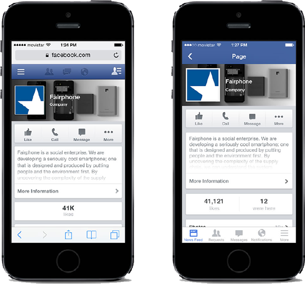

# Unidad 6: Aplicaciones Móviles
<small>
Created by <i class="fab fa-telegram"></i>
[edme88]("https://t.me/edme88") & 
<i class="fab fa-telegram"></i>
[rmarku]("https://t.me/rmarku")
</small>

---
## Libros:

[“Diseñando APPS para móviles” Javier Cuello y José Vittone](http://appdesignbook.com/es/contenidos/tipos-de-apps/)

---
## Aplicaciones Moviles o APP
Son aplicaciones diseñada para ser ejecutadas en teléfonos inteligentes, tablets y otros dispositivos móviles y que 
permite al usuario efectuar una tarea, facilitando la gestión o actividad a desarrollar.


---
## Aplicaciones Moviles o APP
Inicialmente estaban enfocadas en **mejorar la productividad personal**:
* Alarmas
* Calendarios
* Calculadoras
* Clientes de Correo

---
## Diferencia entre APP y Web Móvil
Las APP deben ser descargadas e instaladas antes de usarse.

Las Webs se acceden empleando internet y un navegador.

Las APPs pueden verse sin internet y tienen acceso a ciertas características del hardware del teléfono.

---
## [Ejemplos de Aplicaciones Móviles](https://www.infobae.com/america/tecno/2020/03/03/cuales-son-las-10-aplicaciones-mas-descargadas-del-mundo/)
<!-- .slide: style="font-size: 0.80em" -->
* Whatsap
* Telegram
* Instagram
* Opera Mini
* Clash of Clans


---
## Categorías de Aplicaciones
### Según el contenido:</h3>
* Entretenimiento
* Sociales
* Utilitarias y Productividad
* Educativas e Informativas
* Creación 

---
## Categorías de Aplicaciones
### Según el costo:</h3>
* Apps Gratuitas 
<p class="fragment"> <small>(mayor llegada a los usuarios, disminuye expectativa del producto, suele incluir publicidad) </small></p>

* Apps de Pago 
<p class="fragment"> <small>(altas expectativas, será exitosa si no tiene rivales gratuitos)</small> </p>

* Fremium 
<p class="fragment"><small>(uso básico, que se amplia al pagar)</small> </p>


---
## Tipos de Aplicaciones
* Aplicaciones Nativas
* Aplicaciones Web
* Aplicaciones Hibridas

---
## Características de App
* Capacidad de comunicarse desde cualquier lugar
* Interfaz de usuario para pantalla y teclado pequeno
* Movilidad del dispositivo
* Disponibilidad de muchos sensores

---
## [Sistemas Operativos para Dispositivos móviles](https://gs.statcounter.com/os-market-share/mobile/worldwide)
* Android
* iOS
* kaios
* ~~Windows Phone~~
* ~~Blackberry~~
* ~~Ubuntu Phone~~
* ~~Firefox OS~~
* ~~Tizen~~
* Fucshia <small>(comming soon...)</small></br>

---
## Apps Android
* **Lenguaje:** Java o Kotlin + Librerias Android
* **IDE:** [Android Studio](https://developer.android.com/studio)
* **SO:** Windows, Linux o Mac
* Emuladores de Dispositivos
    
---
## Apps iOS
* **Lenguaje:** ObjetiveC - Swift
* **IDE:** [XCode](https://developer.apple.com/xcode/)
* **SO:** Mac
* Emuladores de Dispositivos
* Para probarlo en dispositivo, pagar licencia de desarollador


<!--
    http://appdesignbook.com/es/contenidos/diseno-visual-apps-nativas/
    http://www.lancetalent.com/blog/tipos-de-aplicaciones-moviles-ventajas-inconvenientes/
    http://www.batanga.com/tech/13241/que-es-apache-cordova
    https://cordova.apache.org/docs/es/latest/guide/overview/
-->

---
## Tipos de Aplicaciones
* Aplicaciones Nativas
* Aplicaciones Web o Webapps
* Aplicaciones Hibridas


---
## Aplicaciones Nativas
Se desarrolla de forma específica para un determinado sistema operativo, utilizando el Software
Development Kit o SDK de la plataforma.
    
---
## Aplicaciones Nativas
<table style="font-size: 0.7em">
    <tr>
<td>Ventajas</td>
<td>Desventajas</td>
    </tr>
    <tr>
<td>
    <ul>
        <li>Acceso completo al dispositivo (Acceso a cámara y sensores: GPS, acelerómetro, giróscopo, etc)</li>
        <li>Mejor experiencia del usuario</li>
        <li>Visibilidad en APP Store</li>
        <li>Envio de notificaciones a los usuarios</li>
        <li>No requiere conexion a internet</li>
    </ul>
</td>
<td>
    <ul>
        <li>Diferentes habilidades/idiomas/herramientaspara cada plataforma de destino</li>
        <li>Tienden a ser más caras de desarrollar</li>
        <li>El código cliente no es reutilizable entre las diferentes plataformas</li>
    </ul>
</td>
    </tr>
</table>
    </section>

---
## Web APP
Se ejecutan dentro del propio navegador web del dispositivo a través de una URL. Se desarrollan con HTML, JavaScript y CSS.
    
---
## Web APP
<table style="font-size: 0.7em">
    <tr>
<td>Ventajas</td>
<td>Desventajas</td>
    </tr>
    <tr>
<td>
    <ul>
        <li>El código es reutilizable</li>
        <li>Proceso de desarrollo sencillo y económico</li>
        <li>No Necesita Instalarse</li>
        <li>El usuario siempre dispone de la ultima version</li>
    </ul>
</td>
<td>
    <ul>
        <li>Requiere conexión a Internet</li>
        <li>Acceso limitado a características de hardware</li>
        <li>Experiencia del ususario más propia de la aplicación web que de la app nativa</li>
        <li>Requiere mayor esfuerzo de promoción</li>
        <li>Restricciones e inconvenientes en gestión de memoria</li>
    </ul>
</td>
    </tr>
</table>

---
## Web APP


---
## Aplicación híbrida
Es una combinación de las aplicaciones nativas y las webapss. Se desarrollan con lenguajes: HTML, Javascript y CSS por
lo que permite su uso en diferentes plataformas y el acceso a gran parte de las características del hardware del 
dispositivo. Es posible distribuirla en app store.
    
---
## Aplicación híbrida
Una vez que la aplicación está terminada, se compila o empaqueta, y el resultado final es como si se tratara de una aplicación nativa.

---
## Aplicación híbrida
<table style="font-size: 0.7em">
    <tr>
<td>Ventajas</td>
<td>Desventajas</td>
    </tr>
    <tr>
    <td>
        <ul>
            <li>Acceso al dispositivo (Acceso a cámara y sensores: GPS, acelerómetro, giróscopo, etc)</li>
            <li>Visibilidad en APP Store</li>
            <li>El código es reutilizable</li>
            <li>Proceso de desarrollo sencillo y económico</li>
        </ul>
    </td>
    <td>
        <ul>
            <li>Experiencia del ususario más propia de la aplicación web que de la app nativa. 
            Sin embargo, hay formas de usar controles y botones nativos de cada plataforma</li>
        </ul>
    </td>
    </tr>
</table>

<!--http://blog.aplicacionesmovil.com/aplicaciones-celular/desarrollo-de-aplicaciones-hibridas-->

---
## Aplicación híbrida


---


---


---


---
## Frameworks Híbridos
* Apache Cordova
* IONIC
* PhoneGap
* Icenium
* React Native
* Appcelerator Titanium

---
## [Apache Cordova](https://cordova.apache.org/)
Es un framework para desarrollar aplicaciones nativas dentro de un smartphone.
Cuenta con muchas Apis de diversos dispositivos móviles. Permite desarrollar con HTML, JavaScript y CSS
    
---
## Apache Cordova
Permite encapsular CSS, HTML, y código de Javascript dependiendo de la plataforma del dispositivo.
    
Extiende las características de HTML y Javascript para trabajar con el dispositivo.
    
Las aplicaciones resultantes son híbridas ya que están empaquetadas como aplicaciones para su distribución y tienen acceso a las APIs nativas del dispositivo.
    
---
## Ejecución de Cordova
1. Instalar cordova <pre><code>npm install -g cordova</code></pre> 
2. Crear nuevo proyecto <pre><code>cordova create MyApp</code></pre> 
3. Agregar tipo de plataforma <pre><code>cd MyApp cordova platform add android</code></pre> 
4. Conectar un celular con Android (opciones de desarrollador-Depuración de USB) <pre><code>cordova run android</code></pre> 

---
## Ejecución de Cordova 2
1.Abrir el proyecto, y reemplazar el contenido de la carpeta 'www' por un proyecto web
2. Abrir el Android Studio
3. Crear un dispositivo para emular desde 'Tools > Android > AVD Manager'
4. Correr la aplicación en el emulador <pre><code>cordova emulate android</code></pre> 

---
## Por qué Android? 
* Para generar la APP es necesario contar con el Software Development Kit o SDK instalado.
* Android Studio es libre y funciona sobre cualquier SO.
* Para desarrollar APK para iOS se debe emplear MacOS.

<!--https://desarrolloweb.com/manuales/responsive-web-design.html-->

---
## Diseño Responsivo


---
## Diseño Responsivo
Diseño web adaptable, donde la apariencia de las páginas web se adapta al dispositivo que se esté utilizando para visualizarla.


---
## Diseño Responsivo
Se trata de redimensionar y colocar los elementos de la web de forma que se adapten al ancho de cada dispositivo permitiendo una correcta visualización y una mejor experiencia de usuario.
    
Se caracteriza porque los layouts (contenidos) e imágenes son fluidos y se usa código media-queries de CSS3.

---
## Diseño Responsivo


---
## [Media Query](https://developer.mozilla.org/es/docs/CSS/Media_queries)
Se considera un tipo de medio y al menos una consulta que limita las hojas de estilo utilizando características del medio como ancho, alto y color.
    
````css
@media (max-width: 600px) {
  .facet_sidebar {
    display: none;
  }
}

@media (min-width: 700px) and (orientation: landscape) { ... }

````

---
## HTML5: Viewport


---
## [HTML5: Viewport](https://developer.mozilla.org/es/docs/M%C3%B3vil/Viewport_meta_tag)
Es el área de la ventana en donde el contenido web está visible. Generalmente no es del mismo tamaño que la página 
renderizada, en donde se brindan barras de desplazamiento para que el usuario pueda acceder a todo el contenido.

---
## HTML5: Viewport
Dispositivos con pantallas angostas muestran la página en una ventana virtual o viewport, que es usualmente más ancho 
que la pantalla y la comprimen de manera que pueda verse completa. El usuario podrá recorrerla y hacer zoom para ver 
diferentes áreas de la página. Por ejemplo, si una pantalla móvil tiene un ancho 640px, las páginas pueden ser procesadas 
con un viewport de 980px, y después comprimidas para que entren en 640px.

---
## HTML5: Viewport


---
## HTML5: Viewport
Esto se hace porque muchas páginas no están optimizadas para dispositivos móviles y se ven mal cuando son procesadas a un 
ancho de viewport pequeño. El viewport virtual es una forma de resolver el problema de sitios no optimizados para móviles, 
logrando que se vean mejor.

---
## HTML5: Viewport
<!-- .slide: style="font-size: 0.80em" -->
La etiqueta viewport permite definir el ancho, alto y escala del área usada por el navegador para mostrar contenido.
Sino por defecto una web tiene siempre 980px de ancho.

Se le puede configurar
* **width:** Ancho que vamos a declarar
* **initial-scale:** zoom que va tener como inicio (min 0.1)
* **maximum-scale:** zoom máximo permitido
* **user-scalable:** control del zoom en la página para darle la opción al usuario de aumentar o disminuir el tamaño

````css
<meta name="viewport" content="width=device-width, user-scalable=no">
````

---
## Ejercicio: Responsive
Empleando Ejercicios-CSS el template ej_instagram, el contenido debe visualizarse:
* Se deben mostrar 3 columnas las imagenes si la pantalla si la pantalla tiene un minimo de 601px
* Se debe mostrar 1 columna si la pantalla tiene como máximo 600px
* Las imagenes deben ocupar el 100% de su columna

---
## Ejercicio: Responsive
<iframe width="560" height="315" src="https://www.youtube.com/embed/nLImEsvaP2g" frameborder="0" allow="accelerometer; autoplay; encrypted-media; gyroscope; picture-in-picture" allowfullscreen></iframe>

---
## Diseño Responsivo: Características
* Los layouts o imagenes son fluidos y se adaptan a cada pantalla.
* Permite reducir el tiempo de desarrollo.
* Evita los contenidos duplicados.
* Permite compartir los contenidos de una forma más rápida y natural.

---
## Ejercicio: Diseño Responsivo
Emplear alguna herramienta para probar si el sitio web es responsivo.
Se sugiere usar ‘Chrome Developer Tools’ Ctrol+Mayus+i
    
---
## Diseño Responsivo: Consejos
* No usar estilos in-line.
* La web no necesariamente se debe ver igual en todos los dispositivos y navegadores.
* No diseñar especificamente para una plataforma.
* Usar Javascript para lo que es (animación y alternado de colores por CSS).
* Maquetar con DIV y etiquetas semánticas.
* Usar unidades relativas.

---
## Diseño Responsivo: Pilares de optimización
* Todos los navegadores y sistemas
* Todas las resoluciones y tamaños de pantalla
* Todas las velocidades de conexión

---
## [Bootstrap](http://getbootstrap.com/)
Es un framework web desarrollado por Twitter para crear interfaces que se adapten al tamaño de pantalla de diversos dispositivo.

Está basado en HTML5 y CSS3 por lo que es compatible con la mayoría de los navegadores web.
    
---
<!--http://academia-binaria.com/formas/-->
## Bootstrap
Contiene plantillas de diseño con tipografía, formularios, botones, cuadros, menús de navegación y otros elementos de diseño y requiere la librería jQuery para que todos los plugins JavaScript funcionen.
    </section>

---
## Ejercicio: Bootstrap
Empleando Ejercicios-CSS el template ej_instagram, el contenido debe visualizarse:
* Se deben mostrar 3 columnas las imagenes si la pantalla es mediana
* Se debe mostrar 1 columna si la pantalla es pequeña
* Las imagenes deben ocupar el 100% de su columna

<!-- ## Ejercicio: Cordova
Utilizando Cordova, hacer una aplicación hibrida de CV. -->

---
## Primero el Móvil
La filosofía **Mobile First** implica plantear el proceso de diseño teniendo en cuenta el móvil en primer lugar.

Ventaja: Obliga a concentrarse en lo esencial de un producto y a hacer foco solo en lo que tiene sentido para este dispositivo.

---
## Etapas de Desarrollo
<!-- .slide: style="font-size: 0.80em" -->
1. Conceptualización
2. Definición
3. Diseño
4. Desarrollo
5. Publicación


---
### 1. Conceptualización
Idea de aplicación, que tiene en cuenta las necesidades y problemas de los usuarios. Esta idea responde a una 
investigación preliminar y a la posterior comprobación de la viabilidad del concepto.
* Ideación
* Investigación
* Formalización de la idea

---
### 2. Definición
Se describe con detalle a los usuarios para quienes se diseñará la aplicación, usando metodologías como «Personas» y 
«Viaje del usuario». También aquí se sientan las bases de la funcionalidad, lo cual determinará el alcance del
proyecto y la complejidad de diseño y programación de la app.
* Definición de usuarios
* Definición funcional

---
### 3. Diseño
Se crean los primeros prototipos para ser probados con usuarios. Se provee al desarrollador de pantallas modelo 
para la programación del código.
* Wireframes
* Prototipos
* Test con usuarios
* Diseño visual

---
### 4. Desarrollo
El programador se encarga de dar vida a los diseños y crear la estructura sobre la cual se apoyará el funcionamiento de la
aplicación. Una vez que existe la versión inicial, dedica gran parte del tiempo a corregir errores funcionales para asegurar el
correcto desempeño de la app y la prepara para su aprobación en las tiendas.
* Programación del código
* Corrección de bugs

---
### 5. Publicación
La aplicación es puesta a disposición de los usuarios en las tiendas. Se realiza un seguimiento a través de analíticas, 
estadísticas y comentarios de usuarios, para evaluar el comportamiento y desempeño de la app, corregir errores, 
realizar mejoras y actualizarla en futuras versiones.
* Lanzamiento
* Seguimiento
* Actualización

---
## ¿Dudas, Preguntas, Comentarios?

