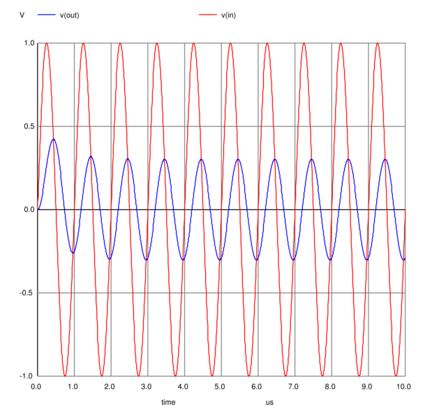

# Unidad 7: Simulación de Circuitos
<small>
Created by <i class="fab fa-telegram"></i>
[edme88]("https://t.me/edme88") & 
<i class="fab fa-telegram"></i>
[rmarku]("https://t.me/rmarku")
</small>

---
## Simulación de Circuitos
Permiten realizar los diseños y mostrar el funcionamiento de los circuitos de forma virtual antes de su montaje con componentes reales.

---
## Ejemplos de Simuladores
* Orcad
* Proteus
* KiCad
* Eagle
* Altium
* MultiSim

---
## Simuladores en Linea
* [CircuitLab](https://www.circuitlab.com/)
* [Logic.ly](http://logic.ly/)
* [The Logic Lab](http://www.neuroproductions.be/logic-lab/)
* [DA/AC Lab](http://dcaclab.com/en/home)
* [EasyEDA](https://easyeda.com/editor)

---
<!--
    http://www.taringa.net/post/linux/15435191/Simuladores-de-circuitos-electricos-y-electronicos.html
    http://www.educacontic.es/blog/simuladores-de-circuitos-electricos-y-electronicos-en-linea
    http://electronica.yoreparo.com/laboratorios_virtuales/programas-de-diseno-electronico-y-simulacion-t316534.html
-->
---
## SPICE
Es un acrónimo inglés de Simulation Program with Integrated Circuits Emphasis.

Es un estándar internacional cuyo objetivo es simular circuitos electrónicos analógicos compuestos por
resistencias, condensadores, diodos, transistores, etc. Para ello hay que describir los componentes,
describir el circuito y luego elegir el tipo de simulación (temporal, en frecuencia, en continua,
paramétrico, Montecarlo, etc.).

---
## Aplicaciones Principales
* Pspice
* Capture
* Layout
* Express/Capture

---
## Spice
Simulación de circuitos analógicos, digitales y mixtos (analógico + digital).

* **Entrada:** Ficheros **.cir** (en el que se describe el circuito y el tipo de simulación) y **.lib** (librerías). se almacenan sub-circuitos o los modelos que describen el comportamiento de los diferentes dispositivos

* **Salida:** Ficheros **.out** (información sobre la simulación y posibles errores) y **.dat** (se almacenan los valores de todas las variables del circuito.)

---
## Schematic o Capture
Descripción gráfica del diseño **.sch**, que puede ser realizada mediante esquema eléctrico o con el lenguaje de descripción hardware VHDL.

---
## Layout
Realización de placas de circuito impreso.

---
## Express/Capture
Diseño de circuitos digitales con dispositivos lógicos programables y memorias

---
## Otras librerias
* **Libreria de Simbolos (.slb):** Almacena la descripción de los símbolos correspondientes a los diferentes componentes electrónicos.

* **Lista de Nodos (.net):** Descripción del circuito (componentes y cómo se disponen)

---
## Ejercicio: FiltroRC Pasa Bajo
[PartSim](http://www.partsim.com/simulator)

---
## Ejemplo: RC filter Transient
<pre><code>
    *RC Filter Transient example

    V1 in 0 sin(0 1 1e6)
    R1 in out 50k
    C1 out 0 10p

    .TRAN 10n 10u
    .end
</code></pre>

---
## Ejemplo: RC filter Transient

---
## ¿Dudas, Preguntas, Comentarios?

