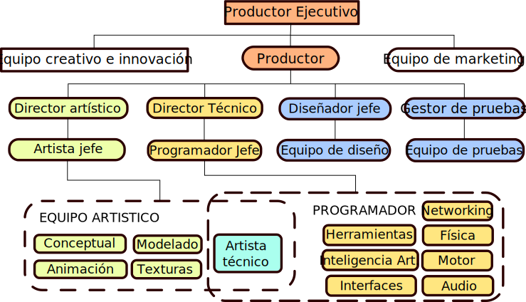
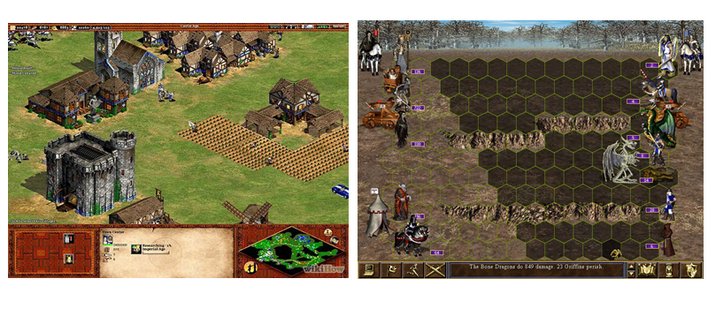
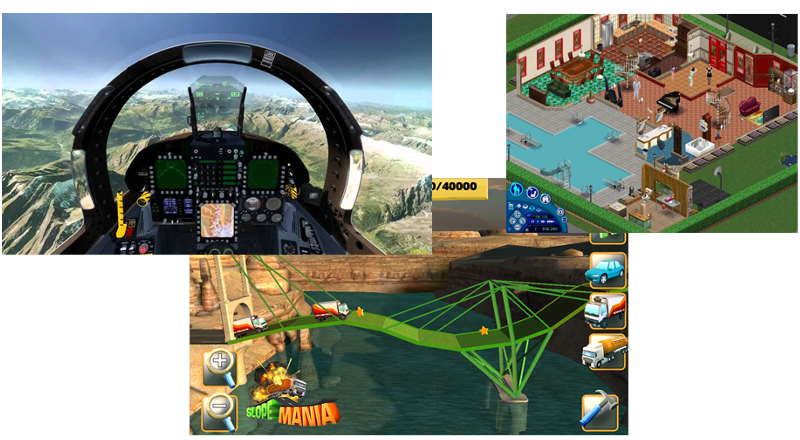
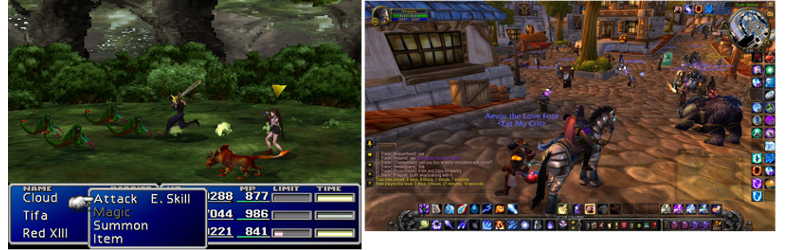
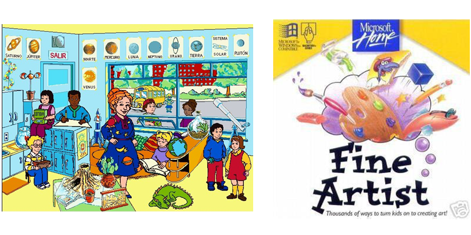
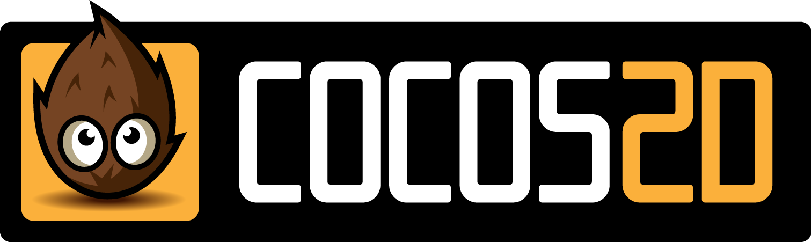
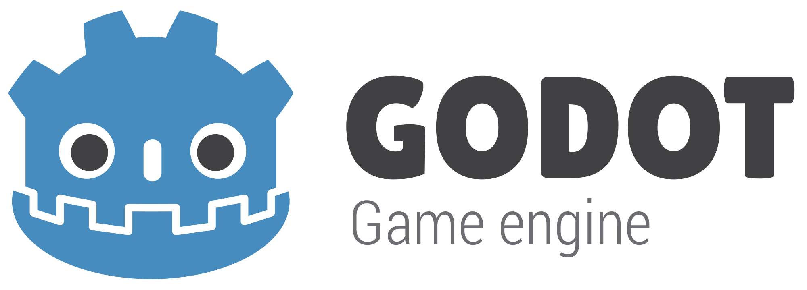

# Diseño de Juegos
<small>
Created by <i class="fab fa-steam"></i>
[edme88]("http://steamcommunity.com/id/edme88") & 
<i class="fab fa-steam"></i>
[rmarku]("http://steamcommunity.com/id/rmarku")
</small>

---
## Libros:

“Desarrollo de Videojuegos: Un enfoque Práctico”
Universidad de Castilla

---
## ¿Qué es un videojuego?
Un VJ es una aplicación gráfica en tiempo real en la que existe una interacción explícita entre el usuario y el videojuego.

Un VJ está asociado al concepto de evolución, un personaje pretende alcanzar objetivos en un universo acotado que tiene ciertas reglas.

---
## ¿Hay equipo?
El desarrollo de VJ requiere de un equipo MULTIDISCIPLINARIO de personas:
* Programadores
* Sonisdistas
* Dibujantes
* Diseñadores Gráficos
* Testers :P

---
## Equipo de Desarrollo

---
## Ciclo de Vida

---
## Tipos de Juegos
* Acción
* Educativos
* Carreras
* Estrategia
* Puzzle
* Aventuras
* Disparos
* Deporte
* Musicales
* Rol
* Sandbox
* Simulación

---
### Accion
* Lucha
* Beat Em Up
* Arcade
* Plataformas

---
### Disparos o Shooters
* Primera Persona
* Tercera Persona
* Shoot Em Up

---
### Estrategia
* Tiempo Real
* Por Turnos

---
### Simulación
* Vuelo
* Construcción
* Vida
* Deporte

---
### Deporte
* Tenis
* Basquet
* Golf
* Skate

---
### Carreras
* Arcade
* Simuladores

---
### Aventura
* Conversacional
* Acción-Aventura

---
### Rol Player Game
* RPG
* MMORPG

---
### Musical
* Karaoke
* Baile
* Instrumentos

---
### Puzzle

---
### Educativo

---
## Diferente tipos de juegos requieren diferents
# MOTORES

---
## ¿Motor?
Es una serie de rutinas de programación que permiten el diseño, la creación y la representación de un VJ.

Proveen al VJ de capacidad para:
* Renderizado de gráficos 2D y 3D
* Detección de Colisiones
* Reproducción de sonidos
* Ejecución de Scripts
* Renderizado de animaciones
* Inteligencia Artificial
* Administración de memoria, etc

---
## Motores de VJ
* Cocos 2D
* Unity
* Godot
* Unreal Engine
* GameMaker
* RPG Maker

---

* Open Source
* 2D
* Lenguaje Nativo
* Multiplataforma
* Gran Comunidad

---

* Versión Personal
* Gran Comunidad
* C#
* Diversidad de Plataformas
* Multiplataforma
* Difícil Optimizar

---

* Open Source
* 2D / 3D
* PC / Android / iOS
* Actualizacion frecuente
* Comunidad Pequeña
* Python

---
## Librerias JavaScript
* MelonJS
* KiwiJS
* Impact
* Phaser
* Game

Para más info:
[https://html5gameengine.com/](https://html5gameengine.com/)

---
## Plataformas
* Mobile
* PC
* Web
* Consolas

---
## Melon.JS
[Tutorial: Plataforma](http://melonjs.github.io/tutorial-platformer/)

[Ejemplo](http://melonjs.github.io/tutorial-platformer/tutorial_step8/index.html)

[Tutorial: Space Invaders](http://melonjs.github.io/tutorial-space-invaders/)

[Ejemplo](http://edme88.github.io/melonSpace/index.html)

---
